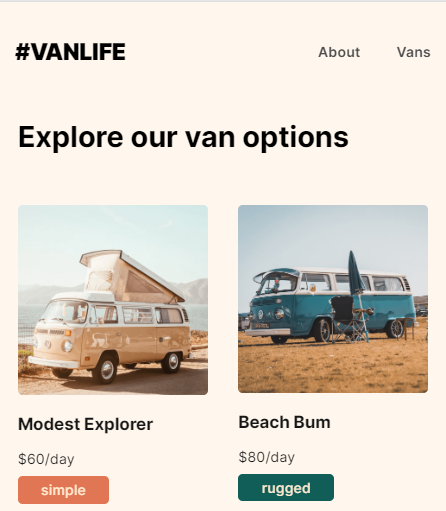
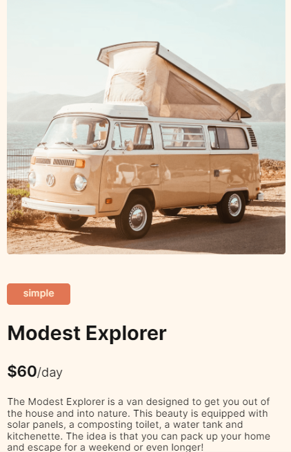

## Table of contents

- [Overview](#overview)
- [1-react-router-introduction](#1-react-router-introduction)

  
  ## Overview

  Build rental van travel app using React Router 6 that is a part of [Scrimba](https://scrimba.com/learn/reactrouter6)'s React Router 6 course. I learned fundamentals and new features of react-router via this app.
  You can see each step creating this app below.

  ## 1-react-router-introduction
  **BrowserRouter, Routes, Route, Link and useParams()** are used to bootstrap of VanLife app in this section.

  ### Visualization of the app;
  ### List vans page;

  
  
  ### List van detail page;
  
