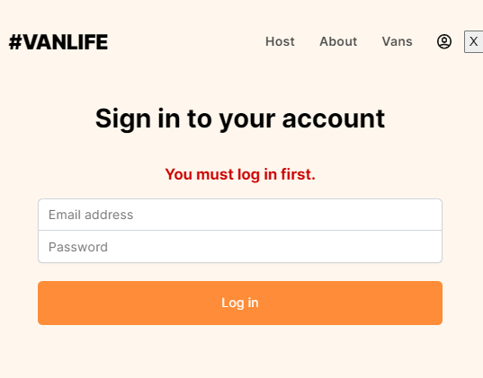
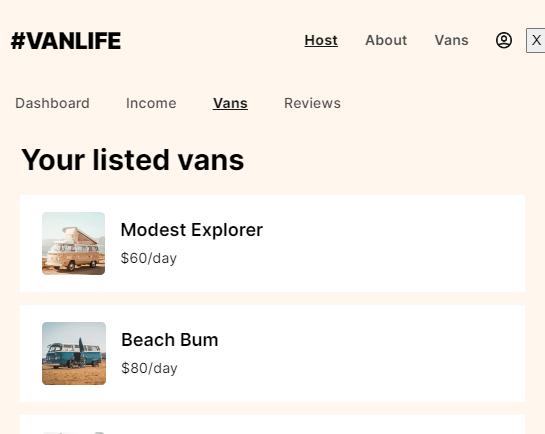

## Table of contents

- [Overview](#overview)
  - [1-react-router-introduction](#1-react-router-introduction)
  - [2-nested-routes](#2-nested-routes)
  - [3-search-params](#3-search-params)
  - [4-loaders-and-errors](#4-loaders-and-errors)
  - [5-actions-and-protected-routes](#5-actions-and-protected-routes)

  
  ## Overview

  Build rental van travel app using React Router 6 that is a part of [Scrimba](https://scrimba.com/learn/reactrouter6)'s React Router 6 course. I learned fundamentals and new features of react-router via this app.
  You can see each step creating this app below.

  ## 1-react-router-introduction
  **BrowserRouter, Routes, Route, Link and useParams()** are used to bootstrap of VanLife app at this section.

  ### Visualization of the app;
  
  ### • Listing van detail page;
  

  ## 2-nested-routes
  **Host** and **Vans** pages and its nested routes added at this section. 
    - When user opens Vans page, they can see listed vans.
    - User can clicks any van detail.
    - User can see van details, pricing and photos on related tabs.

  ### Visualization of the app;
  
  
  
  ## 3-search-params
  **Simple, Luxury and Rugged** filters added on the Vans Listing page
    - When user opens Vans page, they can see listed vans.
    - User can filter van type accordig to Simple, Luxury or Rugged.

  ### Visualization of the app;
  
  
  
  ## 4-loaders-and-errors
  Vans page are improved adding **useLoaderData() and useRouteError()** hooks.
    - When user opens Vans listing page, all vans are listed with useLoaderData() not using state and useEffect()
    - If there is an error fetching to vans data, error page is thrown in detail

  ### • If there is no error on vans page;
  
  
  ### • If there is an error on vans page;
  

 ## 5-actions-and-protected-routes
  Log in forms and protected routes added via  **loaders, actions, useLoaderData(), useActionData(), useNavigation() and React Router Form component**.
    - When user opens Host page, they must log in.
    - If they log in, they can see **Dashboard, Vans, Income and Reviews** pages.

  ### • If users not log in;
  
  
  ### • If users log in;
  
